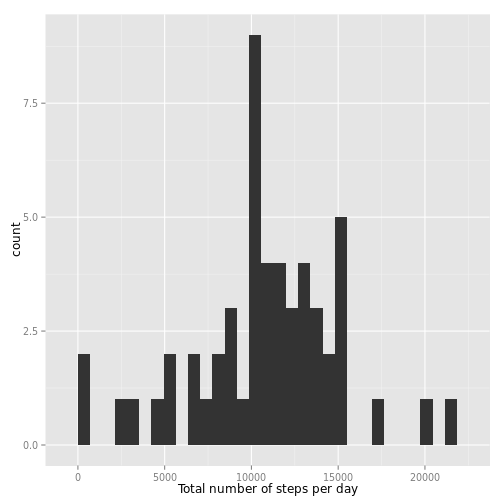

Reproducible Research: Peer Assessment 1
========================================

## Loading and preprocessing the data

Our raw data is supplied in `.zip` format, so we need to uncompress it before loading with `read.csv()`. We also need to transform values in "date" column to Date class.


```r
unzip("activity.zip")
dt <- read.csv("activity.csv")
dt$date <- as.Date(dt$date)
```

## What is mean total number of steps taken per day?

We are required to perform two steps for this question:

(1) Make a histogram of the total number of steps taken each day


```r
dt_total_steps_by_day <- aggregate(dt$steps, by=list(dt$date), FUN=sum)
library(ggplot2)
qplot(x, data=dt_total_steps_by_day, xlab="Total number of steps per day")
```

```
## stat_bin: binwidth defaulted to range/30. Use 'binwidth = x' to adjust this.
```

 

(2) Calculate and report the mean and median total number of steps taken per day


```r
# Mean
mean_total_steps_by_day <- mean(dt_total_steps_by_day$x, na.rm=TRUE)
cat("Mean:", format(mean_total_steps_by_day, scientific=FALSE))
```

```
## Mean: 10766.19
```

```r
# Median
med_total_steps_by_day <- median(dt_total_steps_by_day$x, na.rm=TRUE)
cat("Median:", med_total_steps_by_day)
```

```
## Median: 10765
```

## What is the average daily activity pattern?

We are required to perform two steps for this question:

(1) Make a time series plot (i.e. `type = "l"`) of the 5-minute interval (x-axis) and the average number of steps taken, averaged across all days (y-axis)


```r
dt_avg_steps_by_interval <- aggregate(dt$steps, by=list(dt$interval), 
                                      FUN=mean, na.rm=TRUE)
qplot(Group.1, x, data=dt_avg_steps_by_interval, geom="line", 
      xlab="5-minute interval", ylab="Average number of steps")
```

 

(2) Which 5-minute interval, on average across all the days in the dataset, contains the maximum number of steps?


```r
dt_avg_steps_by_interval[which.max(dt_avg_steps_by_interval$x), 1]
```

```
## [1] 835
```

## Imputing missing values

We are required to perform four steps for this question:

(1) Calculate and report the total number of missing values in the dataset (i.e. the total number of rows with `NA`s)


```r
sum(is.na(dt$steps))
```

```
## [1] 2304
```

(2) Devise a strategy for filling in all of the missing values in the dataset. The strategy does not need to be sophisticated. For example, you could use the mean/median for that day, or the mean for that 5-minute interval, etc.

We are going to use the mean (rounded to integer) for each 5-minute interval to fill in missing values.

(3) Create a new dataset that is equal to the original dataset but with the missing data filled in.


```r
# Create a new data frame by merging the original one and 
# the "mean steps by interval" one by interval
dt_filled <- merge(dt, dt_avg_steps_by_interval, 
                   by.x = "interval", by.y = "Group.1", all.x = TRUE)

# Subsitute missing "steps" values with corresponding "mean steps" values
dt_filled[is.na(dt_filled$steps), "steps"] <- 
  round(dt_filled[is.na(dt_filled$steps), "x"])

# Reshape the new data frame to make it "equal" to the original one
dt_filled <- dt_filled[order(dt_filled[,3], dt_filled[,1]), 
                       c("steps","date","interval")]
row.names(dt_filled) <- NULL
```

(4) Make a histogram of the total number of steps taken each day and Calculate and report the mean and median total number of steps taken per day. Do these values differ from the estimates from the first part of the assignment? What is the impact of imputing missing data on the estimates of the total daily number of steps?


```r
dt_filled_total_steps_by_day <- aggregate(dt_filled$steps, 
                                          by=list(dt_filled$date), 
                                          FUN=sum)
qplot(x, data=dt_filled_total_steps_by_day, 
      xlab="Total number of steps per day")
```

```
## stat_bin: binwidth defaulted to range/30. Use 'binwidth = x' to adjust this.
```

 

```r
# Mean
mean_total_steps_by_day_filled <- 
  mean(dt_filled_total_steps_by_day$x, na.rm=TRUE)
cat("Mean:", format(mean_total_steps_by_day_filled, scientific=FALSE))
```

```
## Mean: 10765.64
```

```r
# Median
med_total_steps_by_day_filled <- 
  median(dt_filled_total_steps_by_day$x, na.rm=TRUE)
cat("Median:", med_total_steps_by_day_filled)
```

```
## Median: 10762
```

The difference between new values and old values (new - old) is:

* Mean: -0.549335
* Median: -3

## Are there differences in activity patterns between weekdays and weekends?

We are required to perform two steps for this question:

(1) Create a new factor variable in the dataset with two levels – “weekday” and “weekend” indicating whether a given date is a weekday or weekend day.


```r
dt_filled[, "weekdays"] <- 
  factor(sapply(weekdays(dt_filled$date, abbreviate=TRUE), 
                function(x) if (x %in% c("Sat", "Sun")) "Weekend" else "Weekday", 
                USE.NAMES=FALSE))
```

(2) Make a panel plot containing a time series plot (i.e. `type = "l"`) of the 5-minute interval (x-axis) and the average number of steps taken, averaged across all weekday days or weekend days (y-axis).


```r
dt_filled_avg_steps_by_interval <- aggregate(dt_filled$steps, 
                                             by=list(dt_filled$interval, dt_filled$weekdays), 
                                             FUN=mean, na.rm=TRUE)
qplot(Group.1, x, facets = Group.2 ~ ., 
      data=dt_filled_avg_steps_by_interval, geom="line", 
      xlab="5-minute interval", ylab="Average number of steps")
```

 

